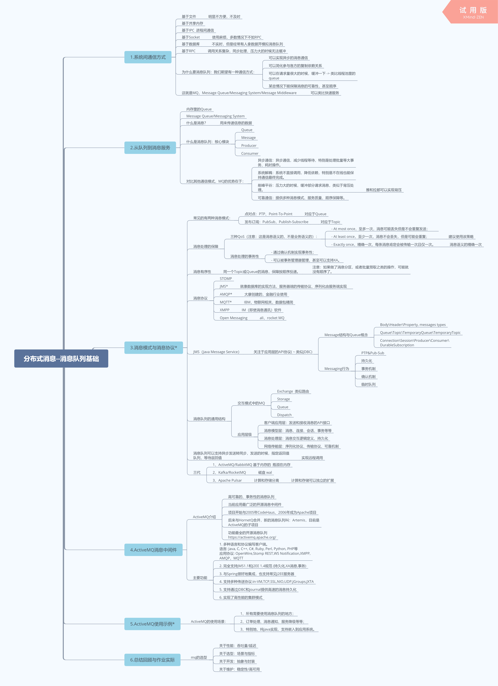
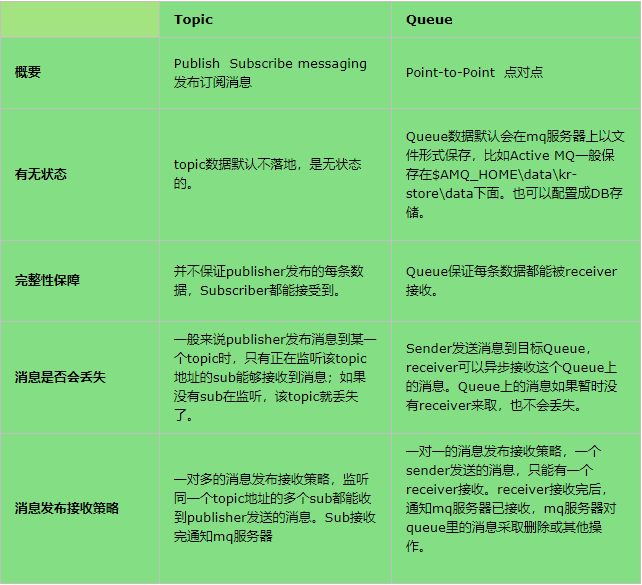

###学习笔记




###作业
1、（必做）搭建ActiveMQ服务，基于JMS，写代码分别实现对于queue和topic的消息
生产和消费，代码提交到github。

//消费者 https://github.com/patrickWuP/JAVA-000/tree/main/Week_12/consumer/src/main/java/com/mq/consumer/activemq

//生产者 https://github.com/patrickWuP/JAVA-000/tree/main/Week_12/producer/src/main/java/com/mq/producer/activemq

2、（选做）基于数据库的订单表，模拟消息队列处理订单：

````
CREATE TABLE `mq_order` (
  `id` bigint(11) NOT NULL AUTO_INCREMENT,
  `user_id` bigint(11) NOT NULL DEFAULT '0' COMMENT '用户id',
  `commodity_id` bigint(11) NOT NULL COMMENT '商品id',
  `commodity_price` decimal(10,2) NOT NULL DEFAULT '0.00' COMMENT '商品价格',
  `state` tinyint(1) NOT NULL DEFAULT '0' COMMENT '0-待支付订单，1-已支付订单，2-已取消订单，99-已删除订单',
  `create_time` datetime NOT NULL DEFAULT CURRENT_TIMESTAMP ON UPDATE CURRENT_TIMESTAMP COMMENT '创建时间',
  `modify_time` datetime NOT NULL DEFAULT CURRENT_TIMESTAMP ON UPDATE CURRENT_TIMESTAMP COMMENT '修改时间',
  PRIMARY KEY (`id`)
) ENGINE=InnoDB DEFAULT CHARSET=utf8;
````

1）一个程序往表里写新订单，标记状态为未处理(status=0);

2）另一个程序每隔100ms定时从表里读取所有status=0的订单，打印一下订单数据，然后改成完成status=1；

3）（挑战☆）考虑失败重试策略，考虑多个消费程序如何协作。
消费方失败重试策略：

方式一：失败则不修改数据的状态，下次跑批会进行处理。需要对一段时间内状态还未变成1的数据进行监控。很可能这些数据无法通过程序正确修改状态，需要人工干预排查问题。

方式二：失败后修改为其他状态（0,1以外的状态），直接通过人工干预去处理。

发送方失败重试策略：

方式一：日志记录 + 重试（重试2次，每次隔2秒）

多个消费程序如何协作：

方式一：作业中通过sql的乐观锁，cas做的处理只修改state=0的数据，由于场景比较简单即使重复修改为1也没有问题。

方式二：如果是修改为1时还有其他的业务的逻辑，可以添加分布式锁在业务层实现幂等。


3、（选做）将上述订单处理场景，改成使用ActiveMQ发送消息处理模式。

4、（挑战☆☆）搭建ActiveMQ的network集群和master-slave主从结构。

5、（挑战☆☆☆）基于ActiveMQ的MQTT实现简单的聊天功能或者Android消息推送。

https://github.com/patrickWuP/JAVA-000/tree/main/Week_12/mq/src/main/java/com/mq/homework/activemq/mqtt

6、（挑战☆）创建一个RabbitMQ，用Java代码实现简单的AMQP协议操作。

7、（挑战☆☆）搭建RabbitMQ集群，重新实现前面的订单处理。

8、（挑战☆☆☆）使用Apache Camel打通上述ActiveMQ集群和RabbitMQ集群，实
现所有写入到ActiveMQ上的一个队列q24的消息，自动转发到RabbitMQ。

9、（挑战☆☆☆）压测ActiveMQ和RabbitMQ的性能。